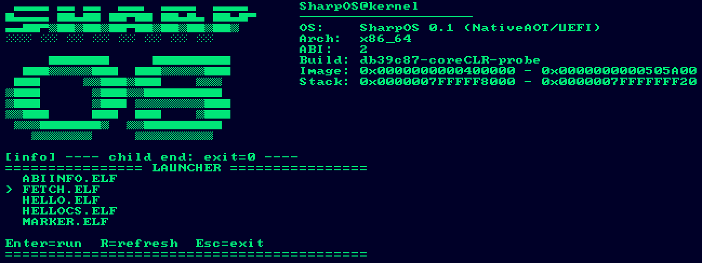

# SharpOS

SharpOS — это экспериментальная операционная система, которая строится как **полностью C#-проект** с управляемым развитием низкоуровневых компонентов.

## Миссия

Сделать ОС, где:

- весь ключевой код ядра, загрузки и пользовательского окружения пишется на C#;
- сборка выполняется через `dotnet`-инструменты;
- архитектура остаётся freestanding и контролируемой, без зависимости от “обычного” desktop/runtime стека;
- по мере развития расширяется собственный std/runtime слой под нужды ОС.

## Стратегическая цель

Долгосрочная цель проекта — пройти путь от минимального freestanding C#-ядра к запуску **полноценного .NET-окружения на SharpOS**.

Практически это означает:

1. Построить устойчивый low-level фундамент (boot, memory, paging, process/app ABI, diagnostics).
2. Развивать собственные системные библиотеки и строково/utility/runtime-подсистемы.
3. Поднять pipeline внешних приложений на C#.
4. Дойти до состояния, где SharpOS способен хостить полноценный .NET runtime.

## Принципы проекта

- `dotnet-first`: всё, что возможно, должно собираться стандартным .NET toolchain.
- `C#-first`: новые подсистемы приоритетно реализуются на C#.
- `contracts first`: сначала API/ABI и границы слоёв, затем расширение функциональности.
- `incremental bring-up`: маленькие проверяемые шаги вместо больших “переписать всё сразу”.

## Контуры Репозитория

- `OS_0.1/src/Boot|Hal|Kernel|TestApp` — код операционной системы и слои ядра.
- `apps/sdk` — ABI/SDK для внешних приложений SharpOS.
- `std/` — отдельный контур разработки no-runtime std/runtime компонентов:
  - `std/no-runtime/` — общий слой для замены частей отсутствующей стандартной библиотеки;
  - `std/string-experiments/` — матрица экспериментов по `string` и runtime-инвариантам.

Правило: всё, что относится к эволюции std/runtime, развивается в `std/`, а не в слоях ОС.

## Что важно

Этот репозиторий фиксирует направление проекта и целевую архитектурную траекторию.  
Текущий прогресс по этапам ведётся отдельно в папке `done/`.
