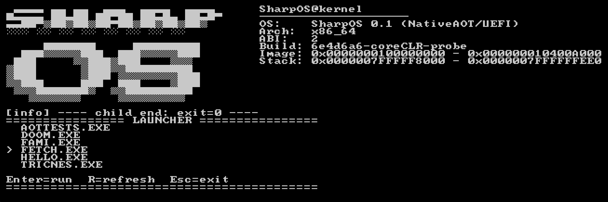
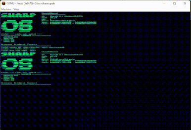
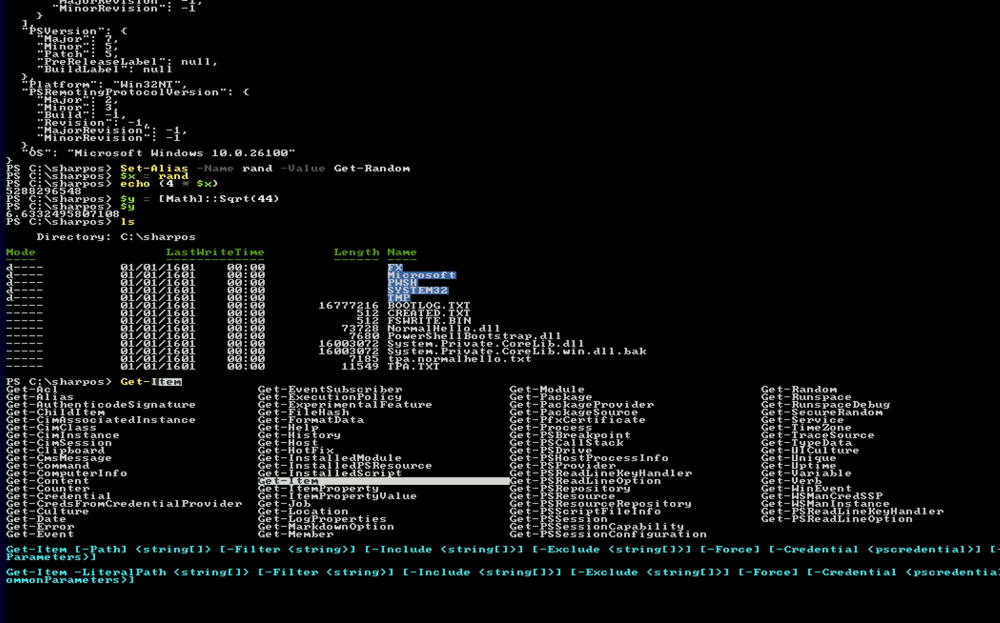

# SharpOS

SharpOS - это экспериментальная операционная система, которая строится как **полностью C#-проект** с управляемым развитием низкоуровневых компонентов.

На SharpOS запускаются стоковый **PowerShell 7.6.5** и играбельный **DOOM**.

[](media/screenshot.png)
 - **весь** код ядра, приложений, загрузки и пользовательского окружения пишется на C# (кроме форка CoreCLR: [dotnet-runtime-sharpos](https://github.com/daniilvaino/dotnet-runtime-sharpos/tree/sharpos/coreclr-port));
 - сборка выполняется через `dotnet publish -r win-x64`.

## Как запустить 
```powershell
# pwsh: оболочка сборки + источник stock-модулей PowerShell
winget install --id Microsoft.PowerShell --source winget --accept-package-agreements --accept-source-agreements
# .NET SDK
winget install --id Microsoft.DotNet.SDK.10 --source winget --accept-package-agreements --accept-source-agreements
# MSYS2: контейнер юникс-утилит сборки образа
winget install --id MSYS2.MSYS2 --source winget --accept-package-agreements --accept-source-agreements
# MSVC link.exe + Windows SDK
winget install --id Microsoft.VisualStudio.2022.BuildTools --exact --source winget --accept-package-agreements --accept-source-agreements --override "--quiet --wait --add Microsoft.VisualStudio.Workload.VCTools --includeRecommended"
 
# --- Утилиты образа внутрь MSYS2: mformat/mcopy (FAT ESP), xorriso (ISO), sfdisk (GPT), qemu-img + qemu-system ---
# Обновление гоняется дважды: первый прогон обновляет ядро MSYS2 и обрывает сессию — это штатно.
C:\msys64\usr\bin\bash.exe -lc "pacman -Syuu --noconfirm"
C:\msys64\usr\bin\bash.exe -lc "pacman -Syuu --noconfirm"
C:\msys64\usr\bin\bash.exe -lc "pacman -S --needed --noconfirm mingw-w64-x86_64-mtools mingw-w64-x86_64-qemu mingw-w64-x86_64-qemu-image-util xorriso util-linux"
 
# --- MSYS2-инструменты в PATH: первая команда — навсегда (реестр), вторая — для текущего окна ---
[Environment]::SetEnvironmentVariable('Path',
  [Environment]::GetEnvironmentVariable('Path','User')+ ';C:\msys64\mingw64\bin;C:\msys64\usr\bin',  'User')
$env:Path = [Environment]::GetEnvironmentVariable('Path','Machine') + ';' +
            [Environment]::GetEnvironmentVariable('Path','User')
 
# --- Репозиторий и shareware-WAD для DOOM ---
# --recurse-submodules обязателен: эмуляторы NES (TriCNES, Fami) подключены
# подмодулями, без него их папки будут пустыми и сборка приложений упадёт.
git clone --recurse-submodules https://github.com/daniilvaino/SharpOS.git
cd .\SharpOS\

# Данные для приложений (IWAD'ы, картриджи) кладутся в payloads\ —
# см. payloads\README.md.
curl.exe -L -o payloads\DOOM1.WAD https://raw.githubusercontent.com/nifanfa/MOOS/refs/heads/master/Ramdisk/DOOM1.WAD

# PowerShell — берётся из payloads\pwsh\ целиком, распакованным.
# Версия важна: сборки несут предкомпилированный код с номером формата, и
# рантайм грузит только свой (16 для .NET 10). 7.5 несёт формат 10 — тогда
# отвергается всё, включая System.Management.Automation (19 МБ), и движок
# компилируется заново при каждом запуске.
curl.exe -L -o pwsh.zip https://github.com/PowerShell/PowerShell/releases/download/v7.6.5/PowerShell-7.6.5-win-x64.zip
Expand-Archive pwsh.zip -DestinationPath payloads\pwsh\PowerShell-7.6.5-win-x64
 
# --- Приложения (лаунчер, FetchApp, AotTests, DOOM, TriCNES, Fami):
& .\build_launcher.ps1; & .\build_fetch.ps1; & .\build_aottests.ps1; & .\build_doom.ps1; & .\build_tricnes.ps1; & .\build_fami.ps1
 
# --- Ядро + образ + запуск в QEMU ---
$env:SHARPOS_GUI = 1   # окно QEMU (GOP-фреймбуфер) + serial
& .\run_build.ps1 -SkipCoreClr 2>&1 | Tee-Object last_build.log
```

## Архитектурные инварианты

**Инвариант 1 - C# is the only source language.** Весь исполняемый код - на C#. В дереве исходников нет ни одного `.c`, `.cpp`, `.h`, `.asm` или `.s` файла. Ни одного. Сборку и запуск, как и в любом .NET-проекте, оркестрируют MSBuild (`.csproj`/`.props`/`.targets`) и PowerShell (`.ps1`) - это не логика системы, а её build-обвязка. Всё остальное - обработчики прерываний, spill callee-saved regs, runtime-bridges, write barriers, interface-dispatch trampolines - выражается одним из трёх способов:

1. **C# intrinsics** (включая `[RuntimeExport]`, `[UnmanagedCallersOnly]`, `delegate* unmanaged`, `fixed`, unsafe pointer arithmetic).
2. **Shellcode-эмиссия из C#** - генерим машинный код в exec-stub buffer (аллокация через `AllocatePool(EfiLoaderCode)` для гарантированной исполнимости):
   - **Early-boot (compile-time codegen Iced assembler через `BootAsm.Generator`)** - Roslyn incremental source generator материализует kernel-shellcode стабы **на этапе сборки OS** из Iced api в pre-baked `ReadOnlySpan<byte>` template'ы в `.rdata`. На runtime - `Span.CopyTo` из template'а в exec-stub, плюс точечный патч qword'ов для managed-callback адресов через явно параметризованные дырки (`MovHole`, `JmpRelHole`, `DataSlotHole`, `PushImm32Hole`). Покрывает 16 стабов (interface dispatch, byref assign, IDT trampolines, EH funclets, GC stack spill, port I/O, etc) - весь early-boot тонкий слой, до того как managed GC/heap/threading доступны.
   - **Late-tier (runtime Iced assembler)** - после того как boot закончился и `KernelHeap`/`GcHeap`/managed exceptions работают, новый shellcode можно эмитить Iced прямо в runtime: `new Assembler(64); a.mov(rax, rcx); a.Assemble(writer, rip);`. Используется для динамически-параметризованного кода, после старта std. 
   - Граница: compile-time codegen Iced - пока ничего нельзя аллоцировать, runtime Iced - когда уже всё доступно.
3. **Build-time COFF data symbol emission через `CoffStub.Generator`** - когда MSVC-style линкер требует native data symbol (пример - `__security_cookie` для CRT-aware codegen) и ILC's `[RuntimeExport]` на static field его не эмиттит (исторический ILC gap), MSBuild Task сканит C# код Roslyn'ом, находит `[CoffDataSymbol(...)]` атрибут, материализует tiny `.obj` файл с native data symbol'ом и кидает его в `@(NativeLibrary)` перед link'ом. Из managed C#:
   ```csharp
   [BootAsm.CoffDataSymbol("__security_cookie", Section = ".data", Alignment = 8)]
   public static ulong SecurityCookie = 0x2B992DDFA232UL;
   ```
   Никаких `.c` файлов в дереве, никаких ручных compile-step'ов - pure C# source с атрибутом, всё остальное делает build pipeline. Native apps (`apps_native/`) собираются как freestanding win-x64 PE через тот же `CoffStub.Generator` (общий `apps_native/sdk/FreestandingPe.props`, `dotnet publish` без WSL).

Любая новая low-level задача должна решаться одним из этих трёх механизмов. Если задача кажется нерешаемой - задача сформулирована неправильно. Примеры из реальной работы: managed GC stack-spill, CR3 read/write, CPU cookie, interface dispatch с shared-generic resolver, NativeAOT module init без линкерных сентинелов `__modules_a..__modules_z` - всё это решено в рамках инварианта.

Насколько нам известно, **других OS-проектов с этим инвариантом не существует**.

**Инвариант 2 - Naming discipline.** SharpOS **не переиспользует канонические .NET namespaces и имена типов** если реализация не полностью совместима с публичным контрактом BCL (modulo ограничения, задокументированные в [docs/nativeaot-nostd-kernel-limits.md](docs/nativeaot-nostd-kernel-limits.md)). Частичные / нестандартные реализации живут в SharpOS-specific namespace-ах (`SharpOS.Std.*`, `OS.Kernel.*` и т.д.), полноценные BCL-compat - в `System.*` и `System.Collections.Generic.*` с оригинальными именами. Это правило позволяет в перспективе таскать LINQ и прочий BCL-код из dotnet/runtime целиком как есть.

## Поверхности исполнения (three execution tiers)

В SharpOS code исполняется на **трёх различных tier'ах**, каждый со своими ограничениями. Live-журнал каждого - в `docs/`:

| Tier | Что | Где | Toolchain | Подробно |
|---|---|---|---|---|
| **Kernel-AOT** | Само ядро + boot + drivers + scheduler | `OS/` | NativeAOT + NoStdLib + наш MinimalRuntime | [`docs/nativeaot-nostd-kernel-limits.md`](docs/nativeaot-nostd-kernel-limits.md) |
| **PE-app (AOT)** | Пользовательские apps через AppService | `apps_native/` (`HELLO.EXE`, `AOTTESTS.EXE`, `DOOM.EXE`, и т.д.) | NativeAOT + NoStdLib + общий `apps_native/sdk/` (FreestandingPe.props, AppHost) | тот же std, что и ядро: [`docs/nativeaot-nostd-kernel-limits.md`](docs/nativeaot-nostd-kernel-limits.md) |
| **CoreCLR-hosted** | Стоковые .NET DLL байт-в-байт | `\sharpos\*.dll` в FAT | Форк CoreCLR (`dotnet-runtime-sharpos`), статически слинкован в kernel | [`docs/coreclr-hosted-limits.md`](docs/coreclr-hosted-limits.md) |

### Легенда

- ✅ - работает, доказано прогоном (см. probe в [`OS/src/Kernel/Diagnostics/`](OS/src/Kernel/Diagnostics/) или гейт в [`tools/probe_report.ps1`](tools/probe_report.ps1)).
- 🟡 - частично / через ограниченный API.
- ⏳ - запланировано, пока не реализовано (roadmap - [`plan.md`](plan.md)).
- 🔴 - пока что отсутствует / временно не работает (код не написан или сломан, но архитектурно достижимо).
- 🚫 - архитектурно невозможно (ограничение by design либо не применимо к данной подсистеме).

### Компаративная таблица фичей

| Функционал | Kernel-AOT | PE-app | CoreCLR-hosted | Комментарий |
|---|---|---|---|---|
| `new T()` / managed heap | ✅ | ✅ | ✅ | |
| Collections (`List<T>`, `Dictionary<K,V>`, и т.д.) | ✅ | ✅ | ✅ | BCL-порты в std; полный перечень - в limits-доках |
| `string`, primitives, structs | ✅ | ✅ | ✅ | |
| `string.Format` / `StringBuilder.AppendFormat` | 🟡 | 🟡 | ✅ | частичное и слабое покрытие в std реализации |
| `lock` (`Monitor.Enter`/`Exit`) | 🔴 | 🔴 | ✅ | `System.Threading.Monitor` отсутствует в std/no-runtime |
| `System.Enum` | 🟡 | 🟡 | ✅ | ToString, Parse, GetNames не реализованы |
| `try` / `catch` / `finally` / `throw;` / `when`-filter | ✅ | ✅ | ✅ |  |
| HW-fault → managed exception (`#PF` → `NullReferenceException`) | ✅ | ✅ | ✅ | |
| `Exception.StackTrace` | ✅ | ✅ | 🟡 | в hosted CoreCLR `StackTrace` пустой для exception'ов брошенных из CLR-internal C++ EH path (`0xE06D7363 PEAVEEMessageException`); см. [`docs/coreclr-hosted-limits.md`](docs/coreclr-hosted-limits.md) §12 |
| Cctor - exception → `TypeInitializationException` wrapping | ✅ | ✅ | 🟡 | в hosted exception из cctor пробрасывается **raw** (не оборачивается в TIE); managed catch на конкретный тип сработает, но `catch (TypeInitializationException)` нет |
| Boxing / unboxing | ✅ | ✅ | ✅ | int/long/struct/Nullable<T>-as-underlying - все работают; `[BoxedEnumerator]` thunks для интерфейсных enumerator'ов на value-типах |
| `[ModuleInitializer]` | ✅ | ✅ | ✅ |  |
| `yield return` (Roslyn state machine) | ✅ | ✅ | ✅ | |
| `async/await` | ✅ | ✅ | ✅ | свои `TaskAwaiter` / `AsyncTaskMethodBuilder` в std. Продолжение исполняется на потоке, завершившем ожидание: контекст синхронизации не захватывается |
| `Task.Run`, `Task.Delay` | ✅ | ✅ | ✅ | не планировщик: задача = поток плюс ожидание, пула потоков нет. В приложениях потоки через таблицу служб (ABI v3) |
| `ThreadPool.QueueUserWorkItem` | ⏳ | ⏳ | ✅ | |
| Array covariance / `stelem.ref` | 🟡 | 🟡 | ✅ | в AOT `RhpStelemRef` **skipped все checks** (null/bounds/covariance) - wrong-type store даёт silent UB вместо `ArrayTypeMismatchException`. Монотипичный stelem работает корректно |
| Generic sharing (USG - `__Canon`) | ✅ | ✅ | ✅ |  |
| Virtual dispatch / interface dispatch (полный резолвер) | ✅ | ✅ | ✅ ||
| Write barrier (`RhpAssignRef`, `RhpStelemRef`) | ✅ (∅) | ✅ (∅) | ✅ | non-generational mark-sweep в AOT → barrier seman'тически no-op; контракт ILC соблюдён.  |
| `GC.Collect` / explicit collection | ✅ | ✅ | ✅ | full mark-sweep cycle; `GC.WaitForPendingFinalizers` зависает в hosted runtime (SYM-003 - finalizer thread не online) |
| Array.Copy overlap (memmove semantics) | ✅ | ✅ | ✅ | left + right shift с overlapping src/dst в одном массиве (`List<T>.RemoveAt`/`Insert` path) |
| `System.Collections.Concurrent.*`, `System.Collections.Immutable.*`, `SortedDictionary`, `SortedSet`, `BitArray`, `KeyedCollection`, `Array.BinarySearch`| 🔴 | 🔴 | ✅ | еще не реализовано, при этом известных блокеров - нет |
| `System.Text.RegularExpressions.Regex` | 🔴 | 🔴 | ✅ | нет имплементации|
| `ValueTuple<...>` / `DateTime` / `DateTimeOffset` | 🔴 | 🟡 | ✅ | отсутствуют в std/no-runtime; `Tuple<T1,T2>` + минимальный `TimeSpan` есть, `DateTime` в PE-аппах - стаб (`Now` = epoch, до RTC-сервиса) |
| LINQ extensions | ✅ | ✅ | ✅ | наш `System.Linq.Enumerable` (mini-LINQ). Source - `List<T>` / итератор / string / массив (порт `Array<T>` даёт массивам честные интерфейсы; limits §4) |
| **Managed delegates / lambdas** | ✅ | ✅ | ✅ | завендорены из dotnet/runtime v8.0.27; вырезано в `NotSupportedException`: reflection-поверхность, GVM, open-instance, variance-cast (limits §5) |
| **Reflection runtime metadata** | 🔴 | 🔴 | ✅ | нет `System.Reflection` в std |
| **`Reflection.Emit`** | 🚫 | 🚫 | ✅ | требует JIT |
| **`Activator.CreateInstance(Type)`** | 🔴 | 🔴 | ✅ | нужны метаданные |
| **`dynamic` / DLR / `Expression<T>.Compile()`** | 🚫 | 🚫 | ✅ | DLR через `Reflection.Emit` |
| **`Type.GetType("Some.Class.Name")`** | 🔴 | 🔴 | ✅ | нужны метаданные |
| **Generic `as T` / `(T)x` с `where T : class`** | 🟡 | 🟡 | ✅ | AOT: `RhTypeCast_CheckCastAny`/`IsInstanceOfAny` есть в std на обоих тирах; вариантный интерфейс-каст не резолвится (limits §2), выделенной пробы нет |
| **Runtime x64 assembled (Iced lib)** | ✅ | 🚫 | 🚫 | пока что `NO_EVEX`, без managed-delegate путей; Guest tiers - by design, доступно после инициализации std |
| **Compile time x64 assembled (Iced lib)** | ✅ | 🚫 | 🚫 | пока что `NO_EVEX`, без managed-delegate путей; Guest tiers - by design |
| `System.Threading.Thread.Start()` | ✅ | 🟡 | ✅ | в приложениях самого `Thread` нет; поток заводится через `AppThreads.Spawn` / `Task.Run` |
| `Interlocked.CompareExchange` (real atomic) | ✅ | 🟡 | ✅ | `System.Threading.Interlocked` это fake-stub из std (read-compare-write без `LOCK` prefix, корректно только для single-thread); ядро же зовёт `X64Asm.CmpXchg64` (real LOCK CMPXCHG) напрямую через `OS.Hal`. AppSDK не expose'ит kernel atomic primitives |
| Cooperative `Yield()` / `Sleep(ms)` | ✅ | ✅ | ✅ | в приложениях через `AppThreads.Sleep` (таблица служб) |
| `Event` / `Semaphore` / `Mutex` | ✅ | ⏳ | ✅ | |
| Multi-thread Process | ✅ | ✅ | ✅ | потоки приложения живут на планировщике ядра |
| **`AssemblyLoadContext` (multiple ALCs)** | 🚫 | 🚫 | ⏳ | требует JIT |
| File I/O (read) | ✅ | ✅ | ✅ | hosted-tier читает DLL/файлы с собственного FAT (в т.ч. post-EBS) |
| File I/O (write) | 🟡 | 🔴 | 🔴 | FAT32: перезапись на месте + создание файла (8.3, зеркалит все FAT). Нет: удаление, рост файла/каталога, LFN |
| USB (xHCI) | 🟡 | 🚫 | 🚫 | свой стек: несколько контроллеров, HID boot-протокол (клавиатура = системный ввод), BOT+SCSI (флешка как `Disk`). Проверено на железе: клавиатура + флешка + запись + DOOM. Опрос без прерываний, без хабов, мышь не подключена |
| Network I/O | 🔴 | 🔴 | 🔴 | нет NIC driver |
| Console keyboard input | ✅ | ✅ | ⏳ | |
| **Direct hardware (CR3 / PCI / MMIO / IDT)** | ✅ | 🚫 | 🚫 | guest tiers - design boundary |
| AVX / AVX-512 | 🔴 | 🔴 | 🔴 | XCR0 заперт на x87\|SSE |
| `Math.Abs` (int/long/short/sbyte) | ✅ | ✅ | ✅ | integer-only в std/no-runtime |
| `Math.Sqrt` / `Math.Abs` (double, SSE intrinsics) | ✅ | ✅ | ✅ | |
| `Math.Sin` `Cos` `Exp` `Log` `Pow` (транцы) | 🟡 | 🟡 | 🟡 | AOT: managed-реализации в std (`Math.Double.cs`) - ряды с редукцией аргумента, ~1e-9, **не ulp-точные**; `Tan`/`Atan`/`Asin`/`Acos`/гиперболики - нет. Hosted: `lm_*` Taylor-приближения в форке (грубее). Порт точных алгоритмов (Cody-Waite + Remez) - в планах |
| `Math.Floor` / `Math.Ceiling` / `Math.Truncate` / `Math.Round` | ✅ | ✅ | ✅ | AOT: managed в std через целочисленную трункацию (контракт: \|x\| < 2^63); Round - half-to-even. Hosted: битовые операции над IEEE 754 |
| Свои аппаратные прерывания (local APIC, тик 100 Гц) | 🟡 | 🚫 | 🚫 | после снятия UEFI: старый PIC замаскирован, тик свой. Устройства опрашиваются, IO-APIC не поднят |
| Вытеснение потоков (тик → переключение) | 🟡 | ⏳ | 🟡 | одно ядро, SMP нет. Включается вокруг проб: остальное ядро кооперативное. В hosted вытесняется и JIT-код (подмена адреса возврата в рантайме отключена, замки настоящие). Остановка мира для GC = подавление вытеснения. В приложениях не проверялось |
| GC (mark-sweep, precise stack scan) | ✅ | ✅ | ✅ | hosted - свой GC через PAL; PE-app несёт **свой** сборщик (своя куча, своя разметка), у ядра одалживает только обход корней стека |
| Многомерные массивы (`int[,]`) | 🟡 | 🟡 | ✅ | ненулевые нижние границы и ранг 1 (`int[*]`) не поддержаны |
| Process exit code propagation | ✅ | ✅ | ⏳ | |
| **Per-process MMU isolation** | 🚫 | 🚫 | 🚫 | unikernel design |
| **Parallel execution at same VA** | 🚫 | 🚫 | 🟡 | single ALC (threads) ✅; multi-ALC ⏳ |
| SMP / multi-core | ⏳ | ⏳ | ⏳ | AP startup + per-CPU TEB + memory barriers |

Реестр того, что сломано, висит или ждёт hardening, вынесен отдельно:
[`limits.md`](limits.md).

## Контуры Репозитория

- `OS/src/Boot|Hal|Kernel|PAL` - код операционной системы и слои ядра.
- `apps_native/` - freestanding win-x64 PE приложения (лаунчер, AotTests-батарея, DOOM) + общий `apps_native/sdk/` (ABI/SDK, FreestandingPe.props).
- `apps_managed/` - стоковые .NET-программы для CoreCLR-hosted tier'а.
- `std/no-runtime/` - общий слой замены стандартной библиотеки (BCL-порты + runtime-хелперы); компилится и в ядро, и в приложения.
- `vendor/` - вендореные библиотеки (Iced, PeNet).
- `done/` - хроника разработки: пошаговые разборы с архитектурой, трассами и решениями.

Правило: всё, что относится к эволюции std/runtime, развивается в `std/`, а не в слоях ОС.

**Активная цель:** расширять `std/no-runtime/` и постепенно переводить unsafe-код в managed C#. Каждая новая строковая/утилитная операция - сначала в `std/`, затем используется из ядра и SDK. `unsafe` остаётся только на ABI-границах и там, где прямой доступ к железу неизбежен.

## DOOM

[](media/doom_small.gif)

([ManagedDoom](https://github.com/sinshu/managed-doom)) запускается на SharpOS против собственной std: freestanding win-x64 PE, WAD с FAT32, GOP-blit 2× на весь экран, PS/2-клавиатура, 35 Hz по HPET. [Полная гифка (41 MB)](media/doom.gif)

## PowerShell

[](media/pwsh.png)

Стоковый **PowerShell 7.6.5** грузится с FAT32 на bare metal до интерактивного prompt'а и выполняет реальные cmdlet'ы (`Get-ChildItem`, `Get-Content`, pipelines, переменные, `[DateTime]::Now`). Это самый требовательный стресс-тест всего стека сразу: TPL, EH, рефлексия, GC, FAT32, ANSI-консоль. Строчный редактор **PSReadLine работает полноценно** (step147): эхо, SGR-цвета, Tab-дополнение, история со стрелками, Backspace/Delete/Home/End — всё поверх нашей framebuffer-консоли на движке XtermSharp. **Ctrl+C прерывает выполняющуюся команду** (step159): клавиши забирает отдельный поток, независимо от того, читает ли их оболочка. Известные ограничения: ConstrainedLanguage Mode, история не сохраняется между запусками (readonly FAT32)

## Сторонние приложения, запускаемые на SharpOS

- **[ManagedDoom](https://github.com/sinshu/managed-doom)** (sinshu, GPL-2.0) — играбелен: полный экран, клавиатура, 35 Гц. GPL изолирован отдельным приложением, в ядро не линкуется.
- **[TriCNES](https://github.com/100thCoin/TriCNES)** (Chris Siebert, MIT, подмодуль) — эмулятор NES, точный: 141/141 на [AccuracyCoin](https://github.com/100thCoin/AccuracyCoin), но для игр бывает медленноват.
- **[Fami](https://github.com/RupertAvery/Fami)** (David Khristepher Santos, MIT, подмодуль) — эмулятор NES, играбелен, не идеален.

## Отдельное спасибо

Проекты на плечах которых воздвинут SharpOS. Перечислены по убыванию вклада:

- **[zerosharp](https://github.com/MichalStrehovsky/zerosharp)** (Michal Strehovský, MIT) - стартовый baseline: UEFI hello-world на NativeAOT, с которого SharpOS стартовал.
- **[dotnet/runtime](https://github.com/dotnet/runtime) + [runtimelab](https://github.com/dotnet/runtimelab)** (Microsoft, MIT) - NativeAOT toolchain (форк в `dotnet-runtime-sharpos/`) + сотни BCL-портов в наш std (`List<T>`, `Dictionary<K,V>`, `String.Format`, `Array.Sort`, introsort, ожидания компилятора, байтовый алайнинг, и т.д.).
- **[Iced](https://github.com/icedland/iced)** (icedland, MIT, vendored `vendor/Iced/`) - x86/x64 encoder. Используется в двух режимах: (1) `BootAsm.Generator`-ом для compile-time codegen kernel-шеллкодов на этапе сборки, (2) baked-in в kernel image для runtime fluent-API shellcode emission после того как boot закончился.
- **[PeNet](https://github.com/secana/PeNet)** (Stefan Hausotte, Apache-2.0, vendored `vendor/PeNet/`) - PE-парсер в лоадере приложений (`PeImageLayout`/`PeImports`/`PeRelocations`, flatten, релокации, IAT).
- **[XtermSharp](https://github.com/migueldeicaza/XtermSharp)** (Miguel de Icaza, MIT, vendored `vendor/XtermSharp/`) - движок эмулятора терминала: разбор ANSI/VT, сетка ячеек, скролл-регионы. Работает front-end'ом консоли ядра поверх framebuffer.
- **[MOOS](https://github.com/nifanfa/MOOS)** (nifanfa, Unlicense / public domain) - драйверы `AHCI`, `Disk`, `PCI(Express)`.
- **[Font 8x8](https://github.com/dhepper/font8x8)** (Daniel Hepper, на основе Marcel Sondaar / IBM VGA, Public Domain) - глифы консоли framebuffer.
- **[shitty](https://github.com/pg83/shitty)** (Anton Samokhvalov, двойная лицензия MIT + GPL-3) - тесты для эмулятора терминала.
- **[ManagedDotnetGC](https://github.com/kevingosse/ManagedDotnetGC)** (Kevin Gosse, MIT) - mark/sweep референс для GC.
- **[UpsilonGC](https://github.com/kkokosa/UpsilonGC)** (Konrad Kokosa, GPL-3) - референс по custom GC под .NET.
- **[DiscUtils](https://github.com/DiscUtils/DiscUtils)** (Kenneth Bell, MIT) - структура FAT/GPT - FAT-референс.
- **[ChaN FatFs](https://elm-chan.org/fsw/ff/)** (BSD-1-clause) - второй FAT-референс.
- **[Cosmos](https://github.com/CosmosOS/Cosmos)** (BSD-3) - концептуальный референс managed-OS подхода (stack-only conservative scan inspiration).

## Лицензия

[CC0 1.0 Universal](LICENSE) - общественное достояние. Используй, изменяй и распространяй в любых целях, в том числе коммерческих.
