# EH as-built map — фактическая карта раскрутки исключений

Снято по коду на состояние **step 128** (2026-07-02). Это **as-built**
диаграмма: только то, что реально происходит, включая поведение
«как есть» (отброшенные return-коды, лимиты, hard-coded константы,
патчи-пластыри). Ничего проектируемого/желаемого здесь нет — для
модели и статуса фич см. [`eh-model.md`](eh-model.md), для известных
дыр — [`eh-audit-2026-06.md`](eh-audit-2026-06.md) и `donext.md`
(P0-1 XMM / P0-2 CollidedUnwind).

Метод: прямое чтение `OS/src/PAL/SharpOSHost/*`, `OS/src/Boot/EH/*`,
`dotnet-runtime-sharpos/src/coreclr/vm/{exceptionhandling,jithelpers,
clrex,excep}.cpp`. Исключение: внутренности `__CxxFrameHandler3` и
часть FH4 — по цитатам из `eh-audit-2026-06.md` (code-read аудит с
точными `file:line`).

При изменении EH-поверхности обновлять эту карту в том же коммите
(тот же протокол, что для limits-таблиц).

## Как читать

- **Зелёное** — ядро C# (наш код), **синее** — форк C++ (`vm/`),
  **фиолетовое** — managed SPC (сток, ноль SHARPOS-ifdef),
  **жёлтое** — поведение «как есть» (факт кода, важный для точности),
  **красное** — halt/panic-концовки.
- Два диспетчера: зелёный `DispatchException`/`RtlUnwind` (наш, ходит
  по нативным кадрам через personality-рутины) и фиолетовый
  `DispatchEx` (сток, ходит по managed-кадрам через SfiNext).
  Точки сцепления: `ProcessCLRException` (наш pass1 → форк),
  `ClrUnwindEx → наш RtlUnwind` (форк → наш pass2),
  `Thread::VirtualUnwindCallFrame → наш RtlVirtualUnwind`
  (SFI форка → наш декодер).
- Маршрут HW-fault — строгий порядок из трёх попыток:
  `SOS-HHE → DispatchFromHwFault → Tier A Dispatch`. `#DE` (vec 0)
  фактически минует CoreCLR-маршрут — гейт стоит на `vec == 13 || 14`
  (`HwFaultBridge.cs:450`), хотя SOS-HHE внутри умеет
  `INT_DIVIDE_BY_ZERO`.

```mermaid
%%{init: {
  "flowchart": {
    "defaultRenderer": "elk",
    "curve": "linear",
    "nodeSpacing": 28,
    "rankSpacing": 42,
    "diagramPadding": 12
  }
}}%%
flowchart TB

%% ================= LEGEND =================
subgraph LEGEND["Легенда"]
  direction LR
  L1["зелёное = ядро C# (наш код)"]:::kern
  L2["синее = форк C++ (vm/)"]:::fork
  L3["фиолетовое = managed SPC (сток, 0 патчей)"]:::spc
  L4["жёлтое = поведение как-есть (факт кода)"]:::asis
  L5["красное = halt/panic-концовка"]:::halt
end

%% ================= HW / IDT =================
subgraph HW["HW-исключение (kernel C#)"]
  direction LR
  CPU["CPU trap: vec 0 #DE / 6 #UD / 13 #GP / 14 #PF"]
  IDT["IDT-трамплин (шеллкод) → InterruptFrame на kernel-стеке"]:::kern
  IDISP["Idt.Dispatch"]:::kern
  SUPP{"IsSupported: vec ∈ {0,13,14}?<br/>(vec 6 #UD объявлен константой,<br/>но в switch НЕ входит)"}:::asis
  PANIC0["PanicDump (legacy)"]:::halt
  DTRAP["HwFaultBridge.DispatchTrap<br/>(HwFaultBridge.cs:77)"]:::kern
  GUARD{"vec14 && CR2 ∈ guard-page<br/>текущего потока?"}
  SOHALT["print '*** STACK OVERFLOW' + while(true)"]:::halt
  BUILD["BuildPal + ResolveException +<br/>ExInfo(HardwareFault) → ExInfoHead.s_head;<br/>диагностика PFEC/PTE; FaultClassify; STI"]:::kern
  V1314{"vec == 13 или 14?"}
  BREC["BuildHwExceptionRecord +<br/>BuildContextFromInterruptFrame<br/>(static s_hwRec/s_hwCtx, без аллокаций;<br/>Context: GP+сегменты+EFlags, XMM-полей нет)"]:::kern
end

CPU --> IDT --> IDISP --> SUPP
SUPP -->|нет| PANIC0
SUPP -->|да| DTRAP --> GUARD
GUARD -->|да| SOHALT
GUARD -->|нет| BUILD --> V1314
V1314 -->|"да"| BREC
V1314 -->|"нет (vec 0 #DE → мимо CoreCLR-маршрута)"| TIERADISP

%% ================= FORK: SOS-HHE =================
subgraph FORKHW["Форк: HW-fault вход (exceptionhandling.cpp)"]
  direction LR
  SOSHHE["SharpOS_CoreCLR_TryHandleHardwareException (:1654)<br/>guards: rec/ctx≠null; g_fEEStarted;<br/>code ∈ {AV, INT_DIV0, INT_OVF};<br/>ExecutionManager::IsManagedCode(RIP)"]:::fork
  SOSFEF["AdjustContextForVirtualStub +<br/>FaultingExceptionFrame::InitAndLink(ctx);<br/>ExInfo(HardwareFault);<br/>AV с info[1] < NULL_AREA_SIZE → code=0 (NRE-маркер)"]:::fork
  RHHW["вызов managed Ex.RhThrowHwEx(code, &exInfo)<br/>(METHOD__EH__RH_THROWHW_EX, :1709)"]:::fork
end

BREC --> SOSHHE
SOSHHE -->|"guards прошли"| SOSFEF --> RHHW --> MDISPEX
SOSHHE -->|"return 0 (любой guard)"| PALSEH

%% ================= ИСТОЧНИКИ THROW (Tier C) =================
subgraph SRC["Форк: программные источники исключений"]
  direction LR
  ILTHROW["managed throw в JIT-коде:<br/>IL_Throw / IL_ThrowExact (jithelpers.cpp:780/933)<br/>→ SoftwareExceptionFrame захватывает контекст"]:::fork
  ILRETHROW["managed 'throw;': IL_Rethrow (jithelpers.cpp:883)"]:::fork
  COMPLUS["native COMPlusThrow / EX_THROW<br/>→ PAL_CPP_THROW = MSVC 'throw ptr'<br/>→ символ _CxxThrowException"]:::fork
  RAWSEH["raw RaiseException из PAL-стабов"]:::fork
  DME["DispatchManagedException (:1740)<br/>EXCEPTION_COMPLUS-record 'MarkAsThrownByUs';<br/>ExInfo(ExKind::Throw)"]:::fork
  RHTHROW["вызов managed Ex.RhThrowEx<br/>(METHOD__EH__RH_THROW_EX, :1804)"]:::fork
  RHRETHROW["вызов managed Ex.RhRethrow<br/>(METHOD__EH__RH_RETHROW, :1861)"]:::fork
end

ILTHROW --> DME --> RHTHROW --> MDISPEX
ILRETHROW --> RHRETHROW --> MDISPEX

%% ================= MANAGED SPC =================
subgraph SPC["Managed SPC (сток, диспетчер №2)"]
  direction LR
  MDISPEX["DispatchEx — двухпроходный managed-диспетчер<br/>(Runtime.Base/ExceptionHandling.cs, 1238 строк,<br/>0 SHARPOS-ifdef); pass1: поиск catch,<br/>filter/finally через QCall-funclet'ы;<br/>результат кладётся в ExInfo (_handlingFrameSP и пр.)"]:::spc
  SFIC["InternalCalls: SfiInit / SfiNext"]:::spc
  ASMOFF["AsmOffsets.cs: 9× '#if false && TARGET_UNIX...'<br/>→ принудительно Windows-layout<br/>REGDISPLAY(0xbf0)/ExInfo/SFI(0x148)"]:::asis
end

MDISPEX <--> SFIC
MDISPEX -. "layout по offset'ам" .- ASMOFF

%% ================= FORK C++ WALKER =================
subgraph FORKW["Форк C++: walker и funclet-механика (vm/)"]
  direction LR
  SFI["StackFrameIterator + ExInfo:<br/>managed-кадры через EECodeManager/GcInfoDecoder,<br/>explicit-кадры через Thread::m_pFrame;<br/>все exit-пути SfiNext логируются [SFI] (step124)"]:::fork
  VUC["для нативных кадров:<br/>Thread::VirtualUnwindCallFrame<br/>→ наш RtlVirtualUnwind (__imp_-алиас)"]:::fork
  DESP["DispatchExSecondPass (:~4900):<br/>цикл SfiNext + InvokeSecondPass<br/>(finally/fault-funclet'ы) до handlingFrameSP, лог [DESP]"]:::fork
  CCF["CallCatchFunclet (:3350):<br/>UpdateNonvolatileRegisters из KNCP"]:::fork
  P71["патч step71: save/restore RBP вокруг UNR<br/>(native-origin RBP из KNCP битый)"]:::asis
  P124["патч step124 CCF-inv: скан 64 байт resume-PC<br/>на 'add rsp,imm32; pop rbp; ret' → патч RSP;<br/>другая форма эпилога → патча нет;<br/>+ безусловные [CCF-resume] принты на каждый catch"]:::asis
  RAC["ResumeAfterCatch → continuation после catch"]:::fork
  CFF["CallFinallyFunclet (:3729) /<br/>CallFilterFunclet (:3756)"]:::fork
end

SFIC --> SFI
SFI --> VUC
MDISPEX -->|"pass1 нашёл catch, managed вернулся"| DESP
DESP --> CCF --> P71 --> P124 --> RAC
MDISPEX -.->|"filter/finally"| CFF

%% ================= PCRE PERSONALITY =================
subgraph PCREG["Форк: ProcessCLRException — personality JIT-кадров"]
  direction LR
  PCRE["ProcessCLRException (:569),<br/>вызывается НАШИМ диспетчером на JIT-кадре"]:::fork
  PCRE1["pass1: [PCRE-corr]-принт;<br/>SHARPOS-патч: bypass corrupted-state fatal<br/>для managed null-deref AV;<br/>иначе IsProcessCorruptedState → FATAL;<br/>затем ClrUnwindEx(rec, thread,<br/>INVALID_RESUME_ADDRESS, establisherFrame) (:754)"]:::fork
  PCRE2["pass2 (флаг UNWINDING):<br/>ExInfo::CreateThrowable — step103c msc-recovery:<br/>double-deref einfo[1] → EEException::GetThrowable<br/>(excep.cpp:5567 + clrex.cpp:586)<br/>→ DispatchManagedException (:782)"]:::fork
  CLRUW["ClrUnwindEx (:1891) → наш RtlUnwind"]:::fork
end

PCRE --> PCRE1 --> CLRUW --> RTLU
PCRE --> PCRE2 --> DME

%% ================= НАШ ДИСПЕТЧЕР №1 =================
subgraph OURS["Ядро C#: PAL SEH — диспетчер №1 (OS/src/PAL/SharpOSHost)"]
  direction TB
  CXXT["CxxThrow = наш _CxxThrowException<br/>(SehDispatch.cs:231)"]:::kern
  RIMPL["RaiseExceptionImpl (:50):<br/>принт типа из RTTI; NativeArena-alloc rec+ctx;<br/>CaptureCurrentContext; UnwindOneFrame;<br/>возврат = Panic"]:::kern
  DEXC["DispatchException (:449):<br/>alloc dc + 3×Context (итого ~5 КБ на throw)"]:::kern
  PASS1["PASS 1 search, лимит 64 кадра:<br/>controlPc = Rip (throw-site) / Rip-1;<br/>учитывается ТОЛЬКО disp==0x100 (ExecuteHandlerMarker);<br/>disp 0/1/2/3 (в т.ч. ContinueExecution и<br/>CollidedUnwind) → просто advance"]:::asis
  IVIP["IsValidIp (:356): canonical-биты;<br/>CoffMethodLookup; InDynamicRange<br/>(dyn+static+stub); IsImageTextGap;<br/>fail → one-shot [ivip]-дамп"]:::kern
  FCH["TryActivateFrameChain (:1361):<br/>чтение Thread::m_pFrame,<br/>hop-limit 16"]:::kern
  MATCHQ{"handler найден?"}
  HREXQ{"C++-throw и в type-chain<br/>есть подстрока 'HRException'?"}
  HRRES["fallback: повторный walk от startCtx<br/>до первого кадра в hard-coded RVA-окне<br/>0xCB5000..0xCDE000 (:715);<br/>RAX = m_hr = *(obj+0x14);<br/>RestoreContextAsm (деструкторы по пути не бегут)"]:::asis
  UNH["Panic 'unhandled exception'"]:::halt
  PASS2["PASS 2 unwind, лимит 64:<br/>флаги UNWINDING / TARGET_UNWIND;<br/>return personality ПОЛНОСТЬЮ отбрасывается (:818);<br/>на matchedFrame при FH4: pre-place Continuation0<br/>в [preRsp-8] (Continuation1 и RAX funclet'а<br/>не используются), Rdx=parent, Rcx=объект"]:::asis
  RTLU["RtlUnwind — наш экспорт (:877):<br/>capture + UnwindOneFrame; цикл 64;<br/>те же FrameChain-хуки; return personality<br/>не читается; на target: Rip=targetIp,<br/>Rsp=target, Rax=retval → RestoreContextAsm;<br/>не дошёл → Panic 'target not found'"]:::kern
  CAPT["CaptureCurrentContext — шаблон BootAsm<br/>@AsmExecBuffer+0x80: GP+EFlags,<br/>ContextFlags=0x100003, XMM/MxCsr НЕ пишутся"]:::asis
  REST["RestoreContextAsm @+0x200: GP+EFlags,<br/>XMM/MxCsr НЕ читаются; target-Rip кладётся<br/>в [newRsp-8] ДО переключения RSP"]:::asis
end

COMPLUS --> CXXT --> RIMPL --> DEXC
RAWSEH --> RIMPL
PALSEH["SehDispatch.DispatchFromHwFault (:223)<br/>— вход без capture, ctx от HwFaultBridge"]:::kern
PALSEH --> DEXC
DEXC --> PASS1
PASS1 --> IVIP
PASS1 -->|"invalid Rip / walked out"| FCH
PASS1 --> MATCHQ
MATCHQ -->|да| PASS2 --> REST
MATCHQ -->|нет| HREXQ
HREXQ -->|да| HRRES
HREXQ -->|нет| UNH
RIMPL --> CAPT
RTLU --> REST
PALSEH -->|"вернулся: handler не найден"| TIERADISP

%% ================= PERSONALITIES =================
subgraph PERS["Personality-рутины в образе (вызываются PASS1/PASS2/RtlUnwind)"]
  direction LR
  PCSH["__C_specific_handler (CrtAndEhStubs.cs:86, наш):<br/>scope-таблица RVA; filter → 1=0x100 / 0=search /<br/>-1=return 0 (ContinueExecution);<br/>__finally-funclet на unwind (rcx=1, rdx=establisher)"]:::kern
  PFH3["__CxxFrameHandler3 (CxxFrameHandler.cs, 424 стр., наш):<br/>FH3 state-machine, dtor-funclet'ы,<br/>state lookup RVA-based"]:::kern
  PFH4["__CxxFrameHandler4 (CxxFrameHandler4.cs, 540 стр., наш):<br/>compact FH4; CatchTransfer наружу через<br/>dc->HistoryTable side-channel;<br/>catch-obj slot = establisherFrame + objOffset"]:::kern
  PGSH["__GSHandlerCheck — НЕ слинкован<br/>(0 вхождений в дереве)"]:::asis
end

PASS1 -->|"personality != null"| PCSH & PFH3 & PFH4 & PCRE
PASS2 -.->|"UNWINDING-вызов"| PCSH & PFH3 & PFH4 & PCRE
RTLU -.->|"UNWINDING-вызов"| PCSH & PFH3 & PFH4 & PCRE

%% ================= LOOKUP REGISTRIES =================
subgraph LOOKUP["SehUnwind: RIP → UNWIND_INFO (LookupFunctionEntry :79, по порядку)"]
  direction LR
  LU["LookupFunctionEntry<br/>первое совпадение побеждает"]:::kern
  S1["1. kernel-image .pdata<br/>(CoffMethodLookup, bin-search)"]:::kern
  S2["2. DynamicLookup: s_dyn, max 64,<br/>переполнение = молчаливый drop (:152)<br/>← SharpOSHost_RegisterFunctionTableCallback<br/>← fork RtlInstallFunctionTableCallback (JIT-хипы)<br/>→ GET_RUNTIME_FUNCTION_CALLBACK форка"]:::asis
  S3["3. StaticTableLookup: s_stat, max 64<br/>← SharpOSHost_RegisterStaticFunctionTable<br/>← RtlAddFunctionTable (R2R .pdata,<br/>peimagelayout.cpp под SHARPOS)"]:::kern
  S4["4. StubRangeLookup: s_stubs, max 1024<br/>← RegisterStubRange ← VirtualMemory.Reserve (C#)<br/>+ fork ExecutableAllocator-хуки<br/>→ синтетический leaf-RF (просто pop [rsp])"]:::kern
  S5["5. ImageTextGapLookup: RIP внутри span .pdata,<br/>но между записями (linker-thunk)<br/>→ тот же leaf-RF"]:::kern
  VU2["VirtualUnwind / ApplyUnwindInfo (:610):<br/>опкоды 0-5 полные (PUSH_NONVOL, ALLOC_L/S,<br/>SET_FPREG c mid-prolog prescan, SAVE_NONVOL/_FAR);<br/>CHAININFO-рекурсия; EstablisherFrame =<br/>fpregEstablished ? FrameReg−off×16 : origRsp"]:::kern
  VUQ["опкоды как-есть: EPILOG(6) = всегда 2 слота;<br/>SAVE_XMM128(8)/FAR(9) = consume-only,<br/>регистры НЕ восстанавливаются;<br/>PUSH_MACHFRAME(10) = no-op 1 слот;<br/>unknown → null + console-принт"]:::asis
  KNCP["RecordSpill → KNONVOLATILE_CONTEXT_POINTERS:<br/>только GP-половина (+0x80), только для<br/>PUSH_NONVOL/SAVE_NONVOL(_FAR);<br/>XMM-половина (0x00-0x7F) не заполняется никогда"]:::asis
end

IVIP -. "проверка RIP" .-> LU
LU --> S1
S1 -->|miss| S2
S2 -->|miss| S3
S3 -->|miss| S4
S4 -->|miss| S5
PASS1 --> VU2
RTLU --> VU2
VUC --> VU2
VU2 --> VUQ
VU2 --> KNCP
KNCP -. "потребители: GcInfoDecoder (GC roots),<br/>UpdateNonvolatileRegisters (resume)" .-> CCF

%% ================= FRAME CHAIN =================
subgraph FCHT["TryActivateFrameChain: типы Frame (Thread::m_pFrame)"]
  direction LR
  FOK["обрабатываются: 1 InlinedCallFrame (f3/f4/f5);<br/>4 FaultingExceptionFrame (ctx @+0x20);<br/>5 SoftwareExceptionFrame (ctx @+0x120,<br/>ctxPtrs @+0x18, RA-fallback @+0x10);<br/>7 PInvokeCalli, 9 PrestubMethod,<br/>10 CallCountingHelper, 11 StubDispatch,<br/>12 ExternalMethod, 13 DynamicHelper —<br/>через TransitionBlock @f[2]:<br/>RA=tb[8], SP=tb+72, RBP=tb[3]"]:::kern
  FNO["любой другой id (HelperMethodFrame,<br/>TransitionFrame, UMThunk...) →<br/>'[fchain] unhandled' → skip к m_Next"]:::asis
  FFILT["фильтры активации: validRA =<br/>InDynamicRange(RA−1); spOk = CallSiteSP > Rsp<br/>(exception-кадры от spOk освобождены)"]:::kern
end

FCH --> FOK
FCH --> FNO
FCH --> FFILT

%% ================= TIER A =================
subgraph TIERA["Tier A: kernel-AOT EH (OS/src/Boot/EH) — отдельный стек"]
  direction LR
  TAE["RhpThrowEx / RhpRethrow / RhpCaptureContext —<br/>9 шеллкод-стабов, патчатся в BootSequence:347-417"]:::kern
  TIERADISP["DispatchEx.Dispatch (DispatchEx.cs:209):<br/>два прохода, свой StackFrameIterator<br/>(порт CoreCLR SFI) + RegDisplay"]:::kern
  TAEH["клаузы: CoffEhDecoder (ILC ehInfoRVA varint);<br/>RIP→метод: CoffMethodLookup (.pdata)"]:::kern
  TAF["CallCatch/Finally/FilterFunclet-стабы, RethrowStub"]:::kern
  TAP["покрытие: пробы L8..L17 зелёные (Probes.cs:37-56)"]:::kern
end

TAE --> TIERADISP --> TAEH
TIERADISP --> TAF
TIERADISP -->|"вернулся (unhandled HW)"| HALTHW["'Dispatch returned' + while(true)"]:::halt

%% ================= TIER B =================
subgraph TIERB["Tier B: ELF-apps"]
  direction LR
  TB["EH НЕТ: ThrowHelpers = while(true)<br/>(apps/sdk/MinimalRuntime.cs:264-287)"]:::halt
end

%% ================= CLASSES =================
classDef kern fill:#d5f0d5,stroke:#2e7d32,stroke-width:1.4px,color:#000
classDef fork fill:#d5e4fa,stroke:#1a56db,stroke-width:1.4px,color:#000
classDef spc  fill:#ead5f7,stroke:#7e22ce,stroke-width:1.4px,color:#000
classDef asis fill:#fdf0c2,stroke:#b45309,stroke-width:1.4px,color:#000
classDef halt fill:#f8d7da,stroke:#b91c1c,stroke-width:1.8px,color:#000
linkStyle default stroke:#64748b,stroke-width:1.2px
```

## Сводка «как есть» (жёлтые узлы одним списком)

| # | Факт | Где |
|---|---|---|
| 1 | PASS 1 учитывает только disp==0x100; `ContinueExecution`(0) и `CollidedUnwind`(3) → advance | `SehDispatch.cs:607` |
| 2 | PASS 2 и `RtlUnwind` отбрасывают return personality целиком | `SehDispatch.cs:818,950` |
| 3 | Context/capture/restore — GP+EFlags only; XMM/MxCsr нигде не переносятся | `SehStructs.cs:106`, `SehDispatch.BootAsm.cs` |
| 4 | `SAVE_XMM128(_FAR)` — consume-only; `PUSH_MACHFRAME` — no-op; `EPILOG` — всегда 2 слота | `SehUnwind.cs:868-884` |
| 5 | KNCP: только GP-половина, только PUSH/SAVE_NONVOL; XMM-указатели не пишутся | `SehUnwind.cs:602` |
| 6 | Реестры s_dyn(64)/s_stat(64)/s_stubs(1024): переполнение = молчаливый drop регистрации | `SehUnwind.cs:152,229,321` |
| 7 | Лимиты walk'а: 64 кадра (все три цикла), 16 hop'ов FrameChain; исчерпание не логируется | `SehDispatch.cs:483,769,897,1386` |
| 8 | HRException-fallback: hard-coded RVA-окно 0xCB5000..0xCDE000, `m_hr` по эмпирическому offset 0x14 | `SehDispatch.cs:715,704` |
| 9 | FH4: используется только Continuation0; Continuation1 и RAX funclet'а игнорируются | `SehDispatch.cs:821-837` |
| 10 | RestoreContextAsm пишет target-Rip в `[newRsp-8]` до переключения RSP (окно для IRQ на том же стеке) | `SehDispatch.BootAsm.cs:75-108` |
| 11 | CCF-inv патч распознаёт единственную форму эпилога `add rsp,imm32; pop rbp; ret` | `exceptionhandling.cpp:3568-3600` |
| 12 | step71: RBP save/restore вокруг UpdateNonvolatileRegisters — consumer-side workaround, корень в KNCP | `exceptionhandling.cpp:3494` |
| 13 | AsmOffsets: 9× `#if false && TARGET_UNIX` — принудительный Windows-layout, без runtime-assert'а | SPC `AsmOffsets.cs` |
| 14 | vec 0 (#DE) минует SOS-HHE/PAL-SEH (гейт `vec==13||14`), уходит сразу в Tier A Dispatch | `HwFaultBridge.cs:450` |
| 15 | vec 6 (#UD) объявлен, но не входит в IsSupported → PanicDump | `HwFaultBridge.cs:38,60` |
| 16 | `__GSHandlerCheck` не слинкован (0 вхождений) | — |
| 17 | Каждый catch в hosted печатает безусловный `[CCF-resume]`-блок (~10 строк + 16-qword стек) | `exceptionhandling.cpp:3540+` |
| 18 | Два независимых декодера UNWIND_INFO: SehUnwind (опкоды 0-5 + consume-only 6/8/9/10) и собственный applier Tier A SFI (только 0-3; SAVE_NONVOL/XMM/MACHFRAME unsupported). Сведение отложено — см. donext.md «Backlog: единый UNWIND_INFO-декодер» | `SehUnwind.cs:610`, `StackFrameIterator.cs:125-165` |
