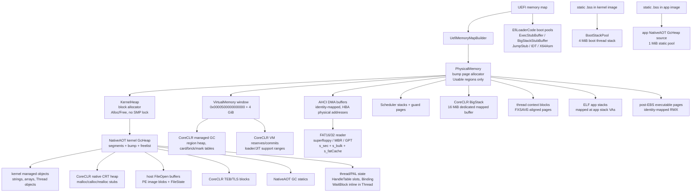
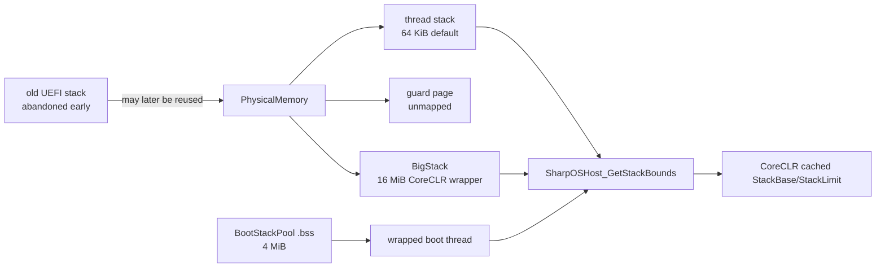

# SharpOS Memory Ownership Map

Цель документа: зафиксировать, кто владеет какой памятью, какие GC имеют
право ее видеть, и где сейчас есть временные пересечения. Это карта для
будущих изменений, чтобы новые стеки, DMA, CoreCLR heap и kernel GC не
переехали друг в друга снова.

## 1. Общая схема

Главный корень page-backed памяти после `PhysicalMemory.Init` -
`PhysicalMemory.AllocPages`. Он не умеет освобождать или переиспользовать
страницы, поэтому все прямые потребители `PhysicalMemory` живут до reboot.

## 2. Адресные домены

| Домен | Диапазон / источник | Владелец | Что там живет | Запрет |
|---|---:|---|---|---|
| Identity low memory | VA == PA из `PhysicalMemory` и MMIO | kernel | `KernelHeap`, DMA, thread stacks, BigStack, context blocks, post-EBS exec | Не считать весь UEFI region стеком или кучей |
| EfiLoaderCode boot pools | UEFI `AllocatePool(EfiLoaderCode)` | `BootInfo` | `ExecStubBuffer`, `BigStackStubBuffer`, `JumpStubExecBuffer`, `IdtExecBuffer`, `AsmExecBuffer` | Не путать с `BootStackPool`; это отдельные firmware allocations |
| CoreCLR VM window | `0x0000500000000000..+0x100000000` | `VirtualMemory` | CoreCLR managed heap, VM reserves, lazy commits | Не класть туда DMA, kernel stacks, app stacks, kernel `GcHeap` |
| Boot stack pool | kernel image `.bss`, 4 MiB | `BootStackPool` | boot thread after early switch | Не выдавать через `PhysicalMemory`; это не UEFI usable memory |
| Hosted thread stacks | pages from `PhysicalMemory`, guard page below | `Scheduler` | CoreCLR/kernel thread stacks | Не выделять из `GcHeap` или `KernelHeap` |
| BigStack | pages from `PhysicalMemory`, identity mapped | `BootSequence` + `BigStack` | CoreCLR session wrapper stack | Не выделять из `GcHeap`; bounds only from `BigStack.TryGetActiveBounds` |
| ELF app stacks | `0x0000004000000000` / `0x0000008000000000` tops | `ProcessImageBuilder` | app primary/nested stacks | Не пересекать с app image mappings и VM window |
| App static GC pool | app image `.bss`, 1 MiB | app `GcMemorySource` | NativeAOT app managed objects | Не смешивать с kernel `GcHeap` или CoreCLR GC |

## 3. Две кучи и два GC

### Kernel NativeAOT `GcHeap`

Источник: `GcMemorySource.KernelHeap` -> `KernelHeap.Alloc` ->
`PhysicalMemory.AllocPages`.

Этот GC видит только свои сегменты и корни, зарегистрированные через
`GcRoots`, плюс консервативный stack scan. Он не знает граф CoreCLR.

Сейчас в kernel `GcHeap` лежат:

- обычные kernel managed objects: `new`, arrays, strings, `Thread`,
  `ManagedThreadBinding`;
- NativeAOT GC statics, материализованные `GcStaticsMaterializer`;
- CoreCLR native CRT allocations через `SharpOSHost_HeapAlloc`;
- CoreCLR `FileOpen` buffers, включая PE blobs;
- `FileState` fake handles;
- CoreCLR TEB/TLS blocks;
- TPA NUL-terminated buffer;
- `HandleTable` slots/object array и Win32/PAL objects reachable from it;
- `ManagedThreadBinding`; `WaitBlock` сейчас inline inside `Thread`, значит
  тоже находится внутри kernel managed `Thread` object;
- часть PAL/SEH временных структур, где они явно выделяются через
  `GcHeap.AllocateRaw`.

Из-за CoreCLR-native allocations kernel sweep должен быть выключен перед
`coreclr_initialize`: `GC.ReclamationDisabled = true`. Иначе kernel GC
увидит CoreCLR-owned native pointers как мусор и может превратить live
blocks в free markers. Это уже не просто оптимизация, а инвариант
текущего дизайна.

### CoreCLR managed GC

Источник: `SharpOSHost_VMReserve/VMCommit` -> `VirtualMemory` ->
`PhysicalMemory.AllocPage`. Виртуальные адреса выдаются только из
нижнего canonical VM window `0x0000500000000000..+4 GiB`.

CoreCLR GC владеет managed objects гостевого .NET, своими region metadata,
card/brick/mark tables и lazy committed pages. Kernel NativeAOT GC не имеет
права сканировать, освобождать или переиспользовать эти объекты.

## 4. Классы аллокаций

| Класс | API | Физический источник | Освобождение | Может содержать managed refs | Основные потребители |
|---|---|---|---|---|---|
| physical pages | `PhysicalMemory.AllocPages` | UEFI `Usable` regions | нет | нет, если выше не наложен GC | VM commits, stacks, DMA, exec pages |
| kernel block heap | `KernelHeap.Alloc/Free` | `PhysicalMemory` | есть free/coalesce, без lock | только как raw memory | kernel runtime backing, strings before/around GC |
| kernel NativeAOT GC | `GcHeap.AllocateRaw` | `KernelHeap` | mark/sweep, но сейчас sweep может быть disabled | да | kernel objects, PAL native buffers |
| CoreCLR VM | `VirtualMemory.Reserve/Commit` | `PhysicalMemory` | `Decommit/Release` no-op | да, но только CoreCLR GC | hosted .NET managed heap and VM |
| AHCI DMA | `Ahci.AllocDma` | `PhysicalMemory` | нет | нет | HBA command/FIS/PRDT/data buffers |
| scheduler stack | `Scheduler.AllocateStack` | `PhysicalMemory` | нет | stack roots only | kernel/CoreCLR hosted threads |
| BigStack | `BootSequence.AllocateBigStack` | `PhysicalMemory` | нет | stack roots only | boot-thread CoreCLR session |
| app static GC | app `GcMemorySource` | app `.bss` | app mark/sweep inside static pool | да | NativeAOT ELF apps |

## 5. Stack model

Правила:

- boot thread как можно раньше уходит с firmware stack на `BootStackPool`;
- новые scheduler threads получают page-backed stack и отдельную guard page;
- BigStack выделяется отдельным page-backed буфером, не из `GcHeap`;
- `SharpOSHost_GetStackBounds` сначала доверяет текущему `Scheduler.Thread`,
  потом активному BigStack, и только потом делает fallback по memory map;
- `GcHeap.FindSegmentContaining(RSP)` полезен только как диагностика
  переполнения/пересечения, а не как источник stack bounds.

Недавний баг был именно нарушением этого правила: BigStack жил внутри
`GcHeap` segment. В результате GC segment и активный стек имели один и тот
же range, а fault classifier видел RSP внутри GC heap. Сейчас BigStack
перенесен на `PhysicalMemory.AllocPages + VirtualMemory.MapFixed`.

## 6. DMA и FAT

AHCI не должен читать или писать напрямую в `GcHeap`/CoreCLR VM/app stack.
Для HBA-visible buffers используется только `Ahci.AllocDma`: physical pages,
identity mapping, zero-fill, address usable as physical PRDT pointer.

FAT mount понимает три container tiers: partitionless superfloppy,
legacy MBR и GPT. Все три сходятся в один read-only FAT16/FAT32 reader.

FAT читает через DMA scratch buffers (`s_sec`, `s_bulk`, `s_fatCache`), а
уже потом копирует в caller buffer. Это правильная граница: файловый buffer
может быть `GcHeap` allocation, но DMA target остается page-backed DMA arena.

## 7. Текущие временные пересечения

Это места, которые работают, но должны считаться техническим долгом:

1. CoreCLR native CRT heap все еще идет в kernel `GcHeap`. Поэтому
   `GC.ReclamationDisabled` обязателен на все время hosted session.
2. `SharpOSHost_FileOpen` держит весь файл в `GcHeap` и RWX-патчит страницы
   PE buffers. Один `System.Private.CoreLib.dll` сейчас имеет payload
   `0x167C000` bytes = около 22.5 MiB; из-за сегментного роста `GcHeap`
   это превращается примерно в 32 MiB `KernelHeap`/physical segment на boot.
   Все остальные opened assemblies добавляются сверху тем же способом.
   Долгосрочно нужен отдельный loader/image arena с protection по секциям.
3. CoreCLR TEB/TLS blocks лежат в `GcHeap`. Они живут достаточно долго
   только потому, что reclamation frozen; лучше вынести в page/slab arena.
4. CRT `free` no-op, VM `Decommit/Release` no-op. Это совместимо с текущим
   bump-only physical allocator, но память не возвращается.
5. `KernelHeap` не защищен lock-ом. На single CPU cooperative это допустимо,
   но preemption/SMP потребуют reentrant heap lock или отдельный IRQ-safe
   allocator.

## 8. Жесткие инварианты

- После `PhysicalMemory.Init` новые page-backed области берутся только через
  `PhysicalMemory`, чтобы не было повторной выдачи одного physical range.
- Стеки нельзя выделять из `GcHeap` или `KernelHeap`. Исключение только
  статический `BootStackPool`, потому что это image `.bss`, не allocator heap.
- DMA buffers выделяются только через `Ahci.AllocDma`.
- CoreCLR managed heap и его VM metadata живут только в `VirtualMemory`
  window `0x0000500000000000..+4 GiB`.
- Kernel NativeAOT GC не сканирует и не освобождает CoreCLR managed heap.
- Пока CoreCLR native allocations используют kernel `GcHeap`, kernel GC
  reclamation должен быть disabled.
- `SharpOSHost_GetStackBounds` не должен использовать весь UEFI memory
  region как stack bounds, если есть точный owner range.
- App static GC pool не смешивается с kernel `GcHeap`.

## 9. Что стоит отделить следующим

M1. Выделить CoreCLR native arena для `malloc/calloc/realloc`: page-backed
   slab или отдельный arena allocator, не `GcHeap`.

M2. Выделить PE/file image arena для `FileOpen`: хранить file blobs вне
   kernel GC, выставлять page protection по секциям.

M3. Перенести TEB/TLS в dedicated page/slab arena.

M4. Добавить boot self-checks:
   - BigStack range не попадает в `GcHeap.FindSegmentContaining`;
   - DMA buffers не попадают в `GcHeap`;
   - VM window не пересекается с app stack VAs;
   - hosted thread `RSP` всегда внутри `Thread.StackBase..StackTop` или
     активного BigStack;
   - `GC.ReclamationDisabled == true` до первого CoreCLR allocation в
     kernel `GcHeap`.

M5. После M1/M2 проверить, можно ли снова включить kernel GC sweep во время
   hosted session или хотя бы ограничить freeze окном загрузки.

## 10. Cumulative Budget

Таблица не является точным heap profiler output. Это static budget из кода:
сколько VA/physical memory гарантированно резервируется или коммитится по
текущим путям.

| Область | Размер / формула | Коммит physical | Источник | Комментарий |
|---|---:|---:|---|---|
| BootStackPool | 4 MiB | image `.bss` | kernel image | Не из `PhysicalMemory`; защищает boot thread от reuse старого UEFI stack |
| EfiLoaderCode stubs | 512 B + 64 B + (4096+4095) B raw + 8 KiB + 1 KiB | firmware pool | UEFI BootServices | `ExecStubBuffer`, `BigStackStubBuffer`, `JumpStub`, `IDT`, `X64Asm`; это не `BootStackPool` |
| KernelHeap base | 16 KiB initial, grows min 16 KiB | yes | `PhysicalMemory` | Backing allocator for kernel `GcHeap` |
| Kernel GcHeap base | 256 KiB first segment | yes via `KernelHeap` | `KernelHeap` | Large allocation grows segment by doubling from 256 KiB until it fits |
| CoreLib file buffer | 22.5 MiB payload, about 32 MiB segment | yes via `KernelHeap` | `GcHeap` | `SharpOSHost_FileOpen`, RWX patched; every full-file open adds more |
| BigStack | 16 MiB | yes | `PhysicalMemory` | Dedicated identity-mapped CoreCLR wrapper stack |
| Kernel thread | 64 KiB stack + 4 KiB guard + 4 KiB context | yes | `PhysicalMemory` | Scheduler default for kernel threads |
| CoreCLR hosted thread | 1 MiB stack + 4 KiB guard + 4 KiB context | yes | `PhysicalMemory` | `ThreadStubs.HostedDefaultStackBytes`; TEB/TLS separately in `GcHeap` |
| CoreCLR VM window | 4 GiB VA window | lazy | `VirtualMemory` -> `PhysicalMemory` | GC hard limit 64 MiB, region range 128 MiB, retain/decommit no-op |
| AHCI device buffers | 34 pages = 136 KiB | yes | `Ahci.AllocDma` | command list + FIS + 32 command tables for one port |
| FAT scratch buffers | 18 pages = 72 KiB | yes | `Ahci.AllocDma` | `s_sec` 4 KiB + `s_bulk` 64 KiB + `s_fatCache` 4 KiB |
| ELF app stack | 8 pages = 32 KiB per image | yes | `PhysicalMemory` | mapped at app stack VA; no physical free yet |
| App static GC pool | 1 MiB per app image | image `.bss` | app image | NativeAOT ELF app heap source |
| HandleTable | about 2 KiB object array + referenced objects | yes via `GcHeap` | kernel managed heap | 256 slots; referenced Events/Semaphores/Threads live as managed objects |

## 11. Основные точки кода

| Подсистема | Файл |
|---|---|
| Physical page allocator | `OS/src/Kernel/PhysicalMemory.cs` |
| UEFI memory type mapping | `OS/src/Boot/UefiMemoryMapBuilder.cs` |
| Kernel block heap | `OS/src/Kernel/Memory/KernelHeap.cs` |
| Kernel NativeAOT GC heap | `std/no-runtime/shared/GC/GcHeap.cs` |
| Kernel GC source | `std/no-runtime/shared/GC/GcMemorySource.KernelHeap.cs` |
| App static GC source | `std/no-runtime/shared/GC/GcMemorySource.AppStatic.cs` |
| GC reclamation gate | `std/no-runtime/shared/GC/GC.cs` |
| CoreCLR VM host exports | `OS/src/PAL/SharpOSHost/VirtualMemoryHost.cs` |
| VM window manager | `OS/src/Kernel/Memory/VirtualMemory.cs` |
| CoreCLR CRT heap stubs | `OS/src/PAL/SharpOSHost/CrtHeapStubs.cs` |
| CoreCLR executable pages | `OS/src/PAL/SharpOSHost/Memory.cs` |
| FAT read allocation path | `OS/src/Hal/Platform.cs` |
| FAT mount/read tiers | `OS/src/Hal/Fat32.cs` |
| AHCI DMA allocator | `OS/src/Hal/Ahci.cs` |
| EfiLoaderCode boot pools | `OS/src/Boot/UefiBootInfoBuilder.cs` |
| Boot stack pool | `OS/src/Boot/BootStackPool.cs` |
| BigStack | `OS/src/Kernel/Memory/BigStack.cs` |
| Thread stacks/contexts | `OS/src/Kernel/Threading/Scheduler.cs` |
| Thread wait/binding state | `OS/src/Kernel/Threading/Thread.cs` |
| CoreCLR thread stack default | `OS/src/PAL/SharpOSHost/ThreadStubs.cs` |
| CoreCLR TEB/TLS | `OS/src/Kernel/Threading/CoreClrTeb.cs` |
| App stack mapping | `OS/src/Kernel/Process/ProcessImageBuilder.cs` |
